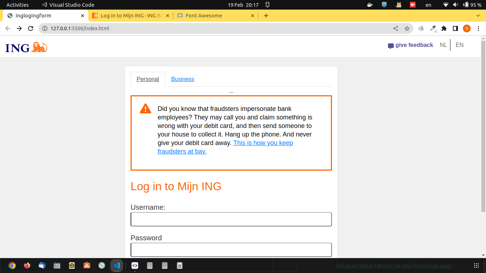

# This is just a practice sample aimed at improving HTML and CSS skills



## Usage

### Install nodejs
[https://nodejs.org/en/download/](https://nodejs.org/en/download/)

### Install mockoon-cli
```
npm install -g @mockoon/cli
```

### Start mockoon server
```
mockoon-cli start -p 3100 -d https://raw.githubusercontent.com/somayehbd/ing-login-template/main/configs/server.json
```

### Login information

#### Personal Account

Username: `demo`

Password: `123456`

#### Business Account

Username: `demo`

Password: `demo`

## Background information

### List mockoon servers
```
mockoon-cli list
```

### Stop a server
```
mockoon-cli stop {SERVER_ID}
```
