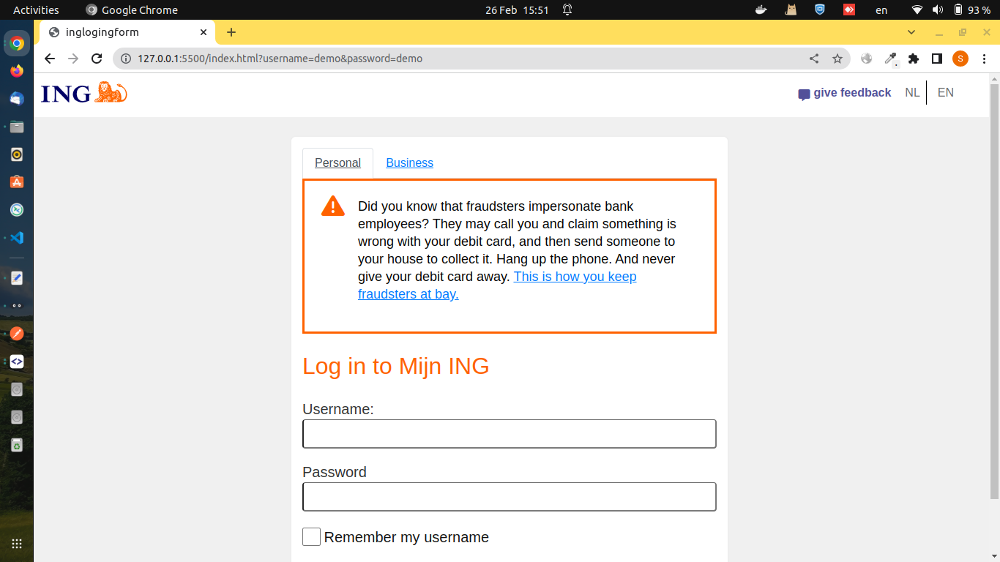

# This is just a practice sample aimed at improving HTML and CSS skills



## Starting Mockoon server
```
mockoon-cli start -p 3100 -d https://raw.githubusercontent.com/somayehbd/ing-login-template/main/configs/server.json
```
